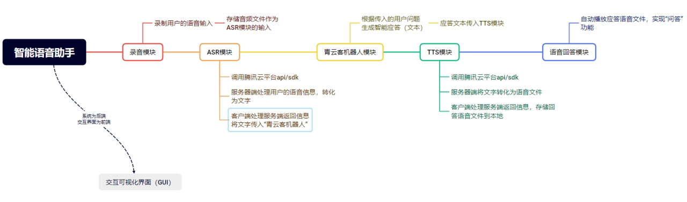
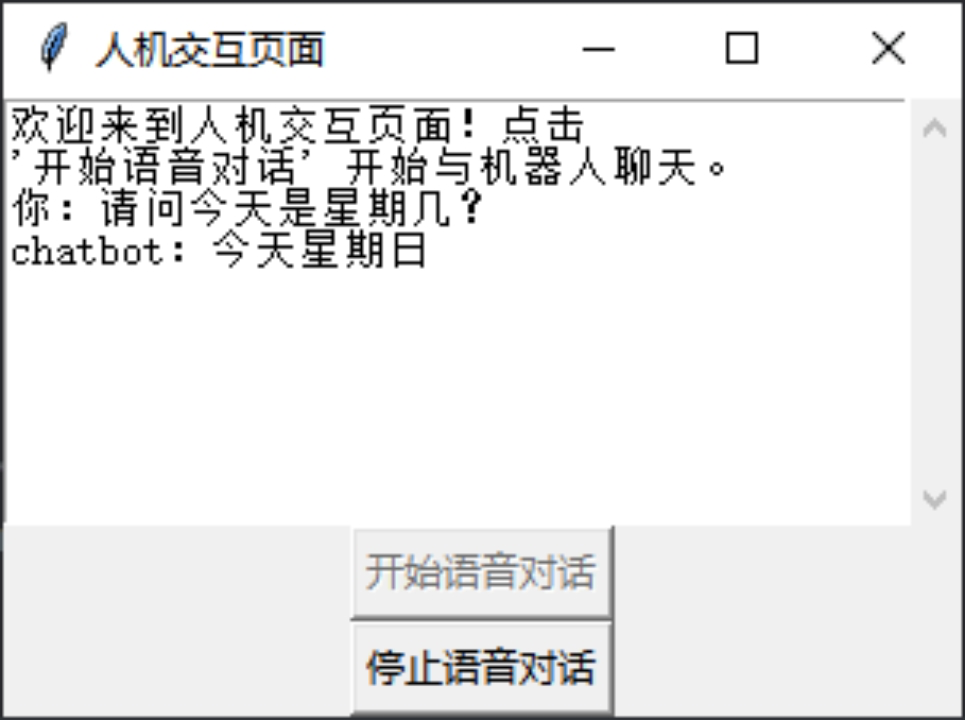

# Simple-ChatBot

Simple-ChatBot 是一个基于 Python 的简易（但蠢笨）智能语音交互机器人项目。

该项目是我在中南大学（CSU）人机交互（HCI）课程中的实验之一。

本学期结束后我会对该项目进行更新，敬请期待！相信它会对你大有帮助！（因为你在网上几乎找不到类似的轻量级资源/项目）

---

ChatBot is an Intelligent Voice Interactive Robot based on python. 
This project is one of the experiments in the HCI course at CSU

I will update this project soon after the end of this term. Please wait and see.l'm sure it will give you a great hand!(because you can't find related light-weight source/projects on the internet)

---

## Overview：

### Pipeline:



* 后端：语音——文本——理解——应答文本——语音
  * 语音——文本：[腾讯云语音识别控制平台](https://cloud.tencent.com/product/asr)
  * 文本理解应答：[青云客智能聊天机器人](http://api.qingyunke.com/)
* 前端：
  * 基于 **Tkinter** 的GUI

> 该项目并不复杂，并没有复杂的前后端，“后端“以``函数``的形式。

### File Structure:

```markdown
├─ Exp_Report.md「详细的实验报告」
├─ README.md
├─ asr
├─ chatbot_withoutGUI.py「基于终端的chatbot——了解后端处理」
├─ chatbot_withGUI.py「基于GUI交互的chatbot——串联前后端处理」
├─ common
├─ examples
│  ├─ asr
│  └─ tts
├─ img
└─ tts
```

---

## Quick Start：

> 1. 在使用之前，建议配合阅读[Exp_Report.md](https://github.com/Gnonymous/Simple-ChatBot/blob/main/Exp_Report.md)
> 2. 前期请配置好[腾讯云语音识别控制平台](https://cloud.tencent.com/product/asr)与[青云客智能聊天机器人](http://api.qingyunke.com/) API Key
> 3. 点击`开始语音对话`开始讲话，点击`停止语音对话`，静待输出响应应答

###  ➪ [chatbot_withoutGUI.py](https://github.com/Gnonymous/Simple-ChatBot/blob/main/chatbot_withoutGUI.py)「建议从此入手，开箱即用」

* [def chat_with_qingyunke(msg)](https://github.com/Gnonymous/Simple-ChatBot/blob/main/chatbot_withoutGUI.py#L10)「处理文本理解与应答」
* [def record_and_save(filename, sample_rate=44100)](https://github.com/Gnonymous/Simple-ChatBot/blob/main/chatbot_withoutGUI.py#L35)「处理语音与文本」
* [def chat()](https://github.com/Gnonymous/Simple-ChatBot/blob/main/chatbot_withoutGUI.py#L84)「对话主循环」

###  ➪  [chatbot_withGUI.py](https://github.com/Gnonymous/Simple-ChatBot/blob/main/chatbot_withGUI.py)「串联前端GUI，开箱即用」

* [Class ChatGUI](https://github.com/Gnonymous/Simple-ChatBot/blob/main/chatbot_withGUI.py#L14)「基于Tkinter的GUI界面」
* [if __name__ == "__main__":](https://github.com/Gnonymous/Simple-ChatBot/blob/main/chatbot_withGUI.py#L133)「处理主线程」



---

### Note：

⚠️该项目仅作学习交流使用，鼓励在此基础上进行二次开发更新，切勿因抄袭导致课程不及格！

⚠️The project is only for learning and communication use, encourage secondary development and update on the basis of again, do not plagiarism lead to course failure!
